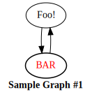
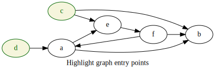
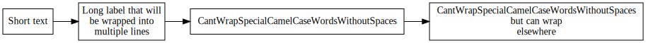
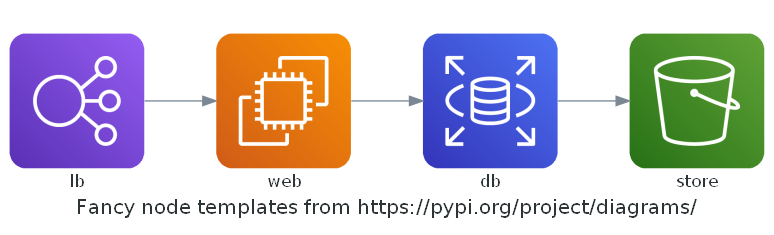

# Manipulate Graphviz graphs in Python prior to rendering

Graphviz wrapper that allows to manage graph objects in Python prior to
translating them into dot language.

## Rationale

Unfortunately, both [graphviz] and [diagrams] packages do not allow any
operations on graphs besides adding nodes and edges. If you want to loop
through all graph nodes or edges to calculate some extra attributes - you're
out of luck.

This small library builds graphs as Python objects prior to translating them
into dot language. That means you can manipulate your graphs programmatically
in any way you want.

[graphviz]: https://graphviz.readthedocs.io/en/stable/manual.html
[diagrams]: https://diagrams.mingrammer.com/


## Usage

### Basic usage

This is nothing special, [diagrams] offers a lot more possibilities here.

```python
from graphviz_managed import Graph
graph = Graph(label='<<b>Sample Graph #1</b>>')
node = graph.node
foo = node(label='Foo!')
bar = node(label='BAR', fontcolor='red', penwidth=1.5)
foo >> bar
bar >> foo
graph.render('basic.svg')
```

[](samples/basic.py)


### Change node style based on number of incoming/outgoing edges

Dynamic graph manipulation is impossible with [graphviz] or [diagrams],
but is rather straightforward with this library:

```python
from graphviz_managed import Graph
graph = Graph(label='Highlight graph entry points', rankdir='LR')
node = graph.node

# Define a larger graph
a = node(label='a')
b = node(label='b')
c = node(label='c')
d = node(label='d')
e = node(label='e')
f = node(label='f')
a >> [b, e]
c >> [b, e]
d >> a
e >> f
f >> [b, a]

# Highlight nodes with no incoming edges
from collections import defaultdict
incoming_count = defaultdict(int)
for edge in graph.edges:
    incoming_count[edge.end] += 1
for node in graph.nodes:
    if incoming_count[node] == 0:
        node.attrs.color = 'darkgreen'
        node.attrs.fontcolor = 'darkgreen'
        node.attrs.style = 'filled'
        node.attrs.fillcolor = 'beige'

# Save output
graph.render('count.svg')
```

[](samples/count.py)

### Break long labels into multiple lines

Providing custom factories for nodes and edges allows for some interesting
customizations.

```python
from graphviz_managed import Graph
from graphviz_managed.custom import WrapLongLabelNode
graph = Graph(node_cls=WrapLongLabelNode, rankdir='LR', node_attrs=dict(shape='box'))
a = graph.node(label='Short text')
b = graph.node(label='Long label that will be wrapped into multiple lines')
c = graph.node(label='CantWrapSpecialCamelCaseWordsWithoutSpaces')
d = graph.node(label='CantWrapSpecialCamelCaseWordsWithoutSpaces but can wrap elsewhere')
a >> b
b >> c
c >> d
graph.render('labels.svg')
```

[](samples/labels.py)

### Wrapper for [diagrams] package

graphviz-managed can be extended to support other graph rendering libraries.
[Here is](src/graphviz_managed/diagrams.py) how it's done for [diagrams].
Resulting objects may be manipulated in the same way, enjoying all pre-rendering
freedoms demonstrated above.

```python
from graphviz_managed.diagrams import Diagram
diag = Diagram(label='Fancy node templates from https://pypi.org/project/diagrams/', pad=0.1)
node = diag.node
lb = node(kind='aws.network.ELB', label='lb')
web = node(kind='aws.compute.EC2', label='web')
db = node(kind='aws.database.RDS', label='db')
store = node(kind='aws.storage.S3', label='store')
lb >> web
web >> db
db >> store
diag.render('diag.png')
```

[](samples/diag.py)

More samples can be found in [tests/](tests/) directory.
